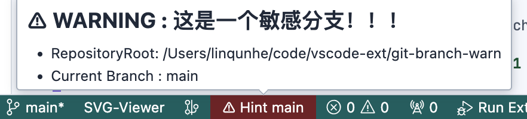
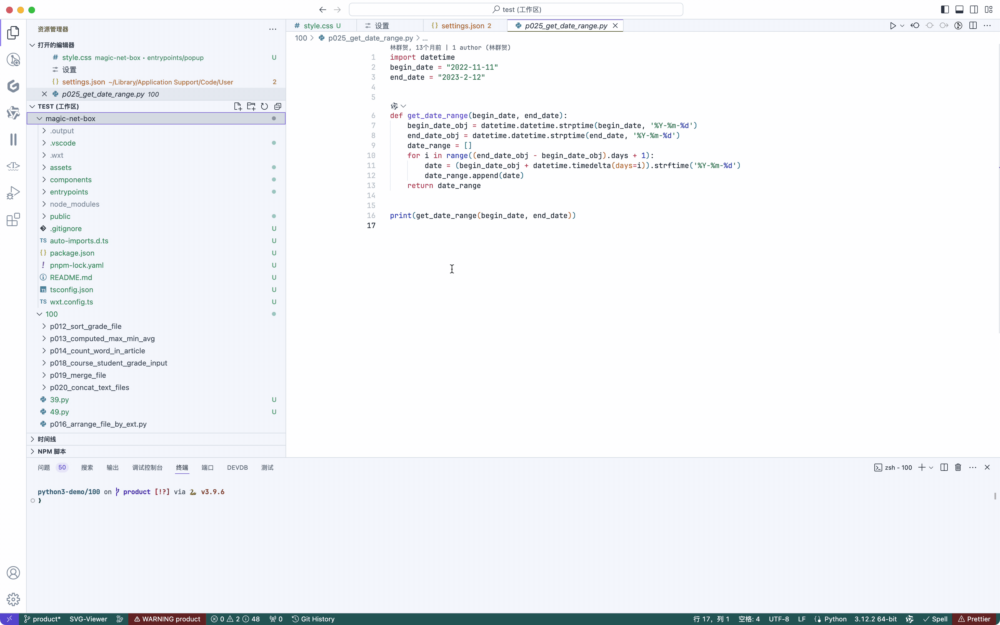

# git-branch-warn README


## Features

- Used to prompt that the current branch is a sensitive branch
- Support setting state bar project name
- Support setting floating prompt word message
- Support for setting up monitoring branches
- Support dynamic detection of single project or multiple projects in the workspace

### demo
#### sensitiveText


### Sensitive Tooltip


### sensitiveBranches
Array of sensitive branches , such as ["test"]

### Quick Identify
Quickly identify the branches of different projects in the workspace, without displaying them for non-Git projects


### plugin setting


## Requirements

```json
"vscode": "^1.80.0"
```

## Extension Settings

default setting

```json
"gitBranchWarning.sensitiveText": "",
"gitBranchWarning.sensitiveTooltip": "",
"gitBranchWarning.sensitiveBranches": [
    "main","master"
],
```

## Known Issues


## Release Notes

Users appreciate release notes as you update your extension.

### 1.0.0

Initial release 


---

## Following extension guidelines

Ensure that you've read through the extensions guidelines and follow the best practices for creating your extension.

* [Extension Guidelines](https://code.visualstudio.com/api/references/extension-guidelines)


## For more information

* [Visual Studio Code's Markdown Support](http://code.visualstudio.com/docs/languages/markdown)
* [Markdown Syntax Reference](https://help.github.com/articles/markdown-basics/)

**Enjoy!**
